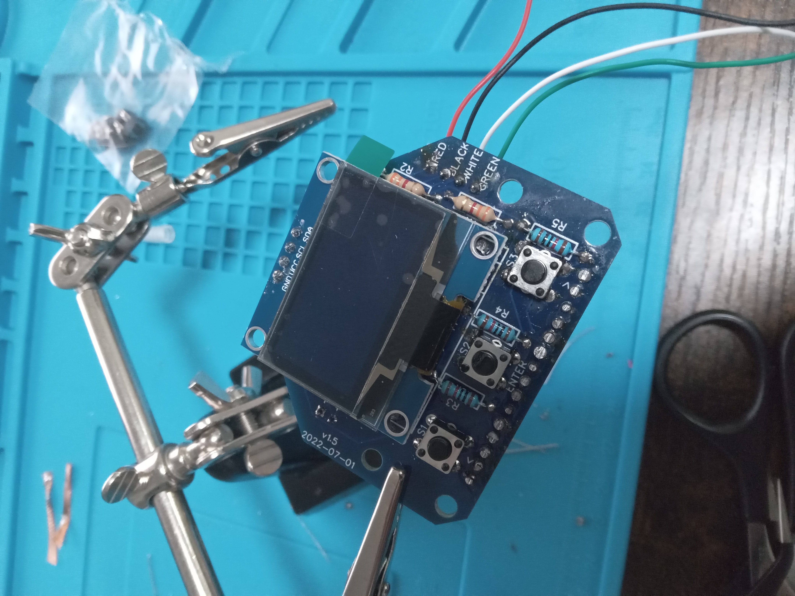
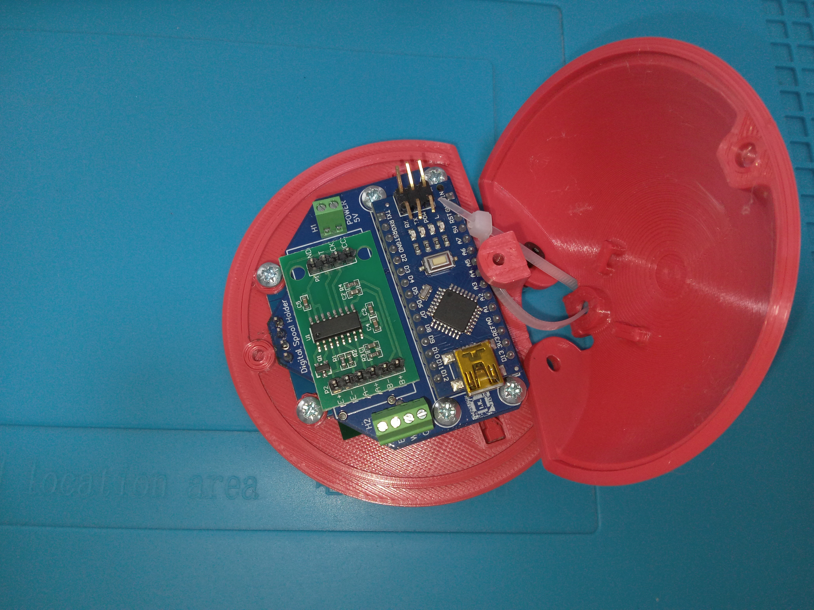
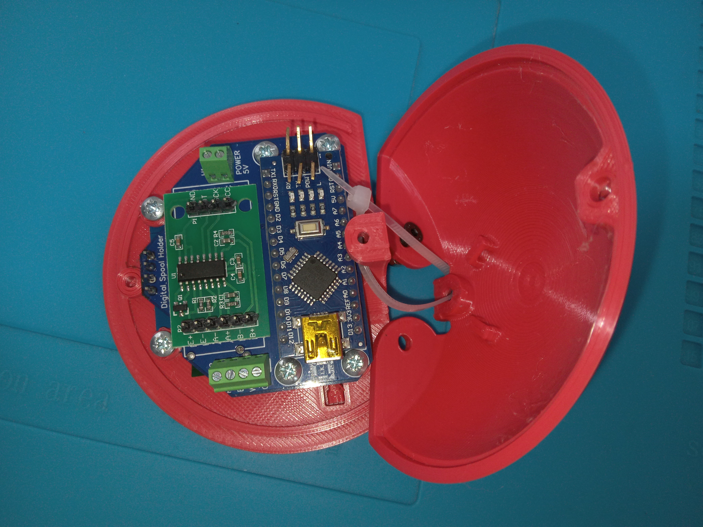

# Digital Spool Holder with Scale

## Project Overview

This is my implementation of the Digital Spool Holder with Scale project, originally created by InterlinkKnight. This project is a DIY filament holder with an integrated scale specifically designed for my Creality Ender 3 V2 3D printer, using Arduino, a load cell, and an OLED display.

**Note:** This implementation is optimized for the Creality Ender 3 V2 printer, but can be adapted for other 3D printers with similar spool holder designs.

**IMPORTANT: WORK IN PROGRESS**

⚠️ **This implementation is still a work in progress** ⚠️

I still need to:
- Get the load cell/strain gauge working
- Redesign the PCB
- Modify the PCB enclosure design

## Acknowledgments

I would like to thank InterlinkKnight for creating this project. As someone coming from a purely software background, this project has been an eye-opening experience into what a "full-stack" electronic device looks like. It's been a fantastic learning experience to see how hardware and software components work together to create a functional device.

## System Overview

> **Note:** The following diagrams are Mermaid diagrams and may not render properly on GitHub's website. For best viewing experience, please view this README in a Markdown editor that supports Mermaid diagrams.

### Hardware Components

The system consists of the following main components:

1. **Load Cell & HX711 Module**
   - Measures weight of the spool
   - Connected to Arduino via HX711 module
   - Can measure weights from 10g to 9999g

2. **Arduino**
   - Main controller
   - Handles all processing and logic
   - Stores settings in EEPROM

3. **OLED Display (1.3" 128x64)**
   - Shows weight readings
   - Displays profile information
   - Menu interface

4. **Control Buttons**
   - LEFT ARROW (Pin 5)
   - ENTER (Pin 6)
   - RIGHT ARROW (Pin 7)

### System Architecture

```
    +---------+    +------------+    +----------+    +------------+
    | Load    |    | HX711      |    | Arduino  |    | OLED       |
    | Cell    | -->| Module     | -->|          | -->| Display    |
    +---------+    +------------+    |          |    +------------+
                                     |          |
    +----------------+               |          |    +------------+
    | Control        |               +----------+    | EEPROM     |
    | Buttons        |--------------------------------| Storage    |
    +----------------+                               +------------+

Hardware Components: Load Cell, HX711, Arduino, Display, Buttons
Software Components: Arduino, EEPROM Storage
```

### Software Components

1. **Weight Measurement System**
   - Real-time weight measurement
   - Deadzone handling for filament fluctuations
   - Calibration system

2. **Profile Management**
   - Up to 20 profiles
   - Stores tare values for different spools
   - Profile name storage (21 characters max)

3. **User Interface**
   - Menu system
   - Profile selection
   - Calibration interface
   - Weight display

4. **Storage System**
   - EEPROM-based storage
   - Profile data persistence
   - Calibration data storage

### Features

- Weight measurement range: 10g to 9999g
- Multiple profile support (up to 20)
- Profile-specific tare values
- Full calibration system
- Deadzone adjustment
- EEPROM storage of all settings
- No menu timeout (user-friendly design)
- Auto-centering text display

### Pin Connections

```
    +------------+    +------------+    +----------------+
    | HX711      |    | OLED       |    | Control        |
    | Module     |    | Display    |    | Buttons        |
    +------------+    +------------+    +----------------+
    | DT   | 2  |    | SCL | A5  |    | LEFT  | 5      |
    | SCK  | 3  |    | SDA | A4  |    | ENTER | 6      |
    +------------+    +------------+    | RIGHT | 7      |
                                        +----------------+
```

## Project Status

This is an active project with the following current status:

✅ Implemented:
- Basic hardware setup
- Arduino code structure
- Display functionality
- Button control system

🚧 In Progress:
- Load cell integration
- Screen case design
- Final calibration

## Implementation Images

| Image | Image |
|-------|-------|
|  |  |
|  |  |
|  |  |
|  |  |
|  |  |

## Getting Started

Note: This section will be updated once the project is complete.

## License

This project is based on the original work by InterlinkKnight. Please refer to their original Instructables page for licensing information.

## References

- Original project: [Digital Spool Holder with Scale](https://www.instructables.com/Digital-Spool-Holder-with-Scale/)