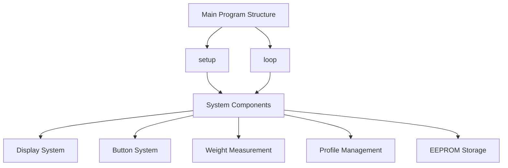
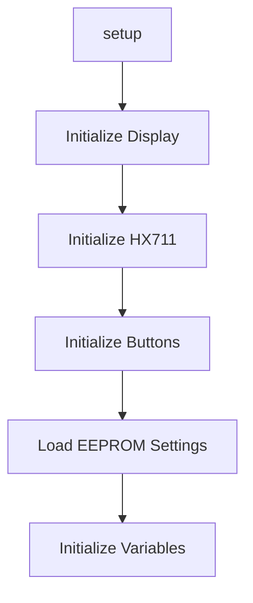
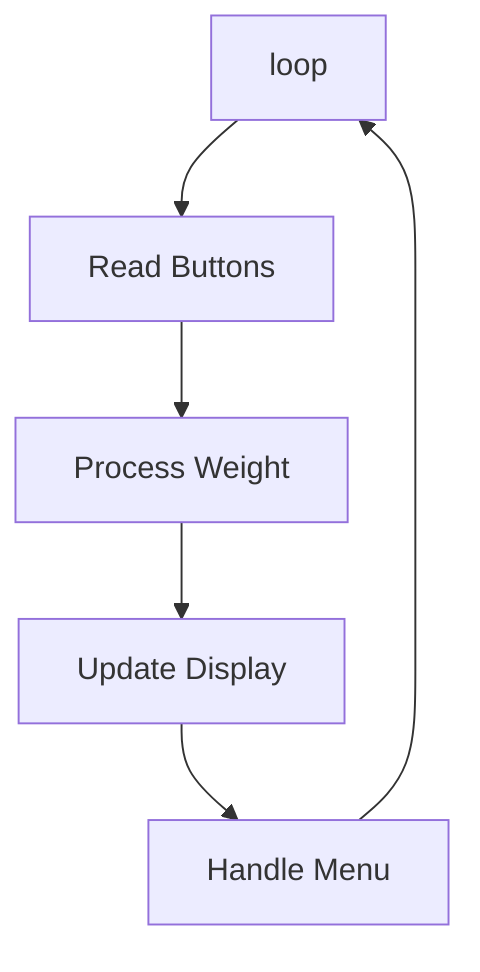

# Digital Spool Holder Code Explainer - AI generated (Windsurf), please read with caution

This document provides a detailed explanation of the digital-spool-holder.ino code, including its structure, flow, and key components.

## Code Structure Overview



## Program Flow

### 1. Initialization (setup)



### 2. Main Loop Flow



## Key Components

### 1. Display System
- Uses U8GLIB library with SH1106_128X64 display
- Handles text rendering and UI elements
- Manages OLED screen updates

### 2. Button System
- Three buttons: LEFT, ENTER, RIGHT
- Debouncing implemented
- State tracking for each button
- Long press handling

### 3. Weight Measurement
- HX711 load cell interface
- Weight smoothing (20 samples)
- Deadzone handling
- Calibration system

### 4. Profile Management
- Up to 20 profiles
- Profile name storage (21 chars max)
- Tare value management
- Profile order management

### 5. EEPROM Storage
- Stores calibration data
- Stores profile information
- Stores settings
- Handles data persistence

## Important Variables

### 1. Weight Variables
```c
long CurrentProfileWeightShown;  // Weight minus empty spool weight
long SmoothedWeight;             // Smoothed weight value
long SmoothedWeightToShowAsInputInDeadzone;  // For deadzone selection
```

### 2. Button Variables
```c
byte EnterButton1PulseOnly;      // One-time pulse flag
byte EnterRepeatWhenWeHoldFrequencyCounter;  // Repeat counter
byte RightButtonActivationStateWithDebounce;  // Debounced state
```

### 3. Profile Variables
```c
char CurrentProfileTitle[22];    // Current profile name
int CurrentProfile;              // Active profile index
long CurrentProfileTare;         // Tare value for current profile
```

### 4. Display Variables
```c
byte WeightYPosition;            // Weight display position
byte SelectBoxWigth;             // Selection box dimensions
byte SelectBoxHeight;
```

## Key Functions

### 1. EEPROM Functions
```c
void writeLongIntoEEPROM(int address, long number)
long readLongFromEEPROM(int address)
void writeIntIntoEEPROM(int address, int number)
int readIntFromEEPROM(int address)
```

### 2. Weight Processing
```c
void ResetSmoothing()
void ProcessWeight()
void UpdateWeightDisplay()
```

### 3. Button Handling
```c
void CheckButtons()
void ProcessButtonPress()
void HandleLongPress()
```

### 4. Profile Management
```c
void LoadProfile()
void SaveProfile()
void CreateNewProfile()
void DeleteProfile()
```

## System Features

### 1. Weight Measurement
- Range: 10g to 9999g
- Deadzone adjustment
- Calibration system
- Smoothing (20 samples)

### 2. Profile System
- 20 profiles max
- Custom tare values
- Profile naming
- Profile order management

### 3. User Interface
- OLED display
- 3-button control
- Menu system
- No timeout feature

### 4. Storage
- EEPROM-based
- Persistent settings
- Profile data storage
- Calibration data

## Important Notes

1. **Calibration**
   - Full calibration required
   - Stores calibration values in EEPROM
   - Handles spool weight variations

2. **Button Debouncing**
   - Prevents false triggers
   - Configurable debounce amount
   - Handles long presses

3. **Weight Smoothing**
   - 20 sample smoothing
   - Reduces fluctuations
   - Configurable deadzone

4. **Profile Management**
   - Custom tare values
   - Profile ordering
   - Persistent storage

## Error Handling

1. **Weight Errors**
   - Minimum weight check (10g)
   - Overload protection
   - Deadzone handling

2. **Button Errors**
   - Debouncing
   - State tracking
   - Hold detection

3. **EEPROM Errors**
   - Data validation
   - Factory reset option
   - Error recovery

## Development Notes

1. **Code Organization**
   - Clear separation of concerns
   - Modular functions
   - Well-documented

2. **Performance**
   - Optimized weight processing
   - Efficient display updates
   - Memory management

3. **User Experience**
   - No timeouts
   - Clear feedback
   - Intuitive controls

This document provides a comprehensive overview of the digital-spool-holder.ino code. For more detailed information about specific functions or components, please refer to the original code comments and documentation.
